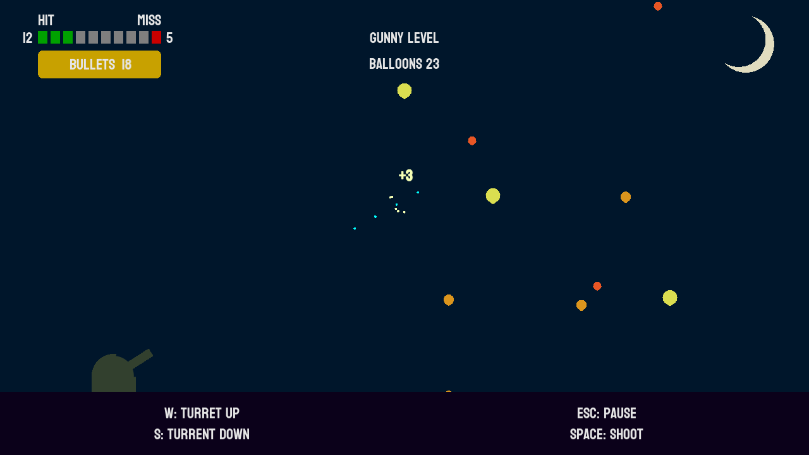

# Midnight Balloon Murder

Small retro game written in [Lua](https://www.lua.org/) using [Love2d](https://love2d.org/).

Screenshot:



## Prerequisites

- Lua version compatible with 5.1.1
- Love version compatible with 11.3

## Running

```shell
# Make a directory
cd somedir

# git clone recursively because submodules
git clone --recursive https://github.com/jspaaks/lua-love-game .

# Add the necesssary directories to the environment variable LUA_PATH
# Note
# - semicolons as separator even on Linux
# - two semicolons at the end, Lua will substitute them with the default path
# - LUA_PATH contents are not real paths, more like expressions for matching
export LUA_PATH="./src/?.lua;./lib/knife/?.lua;;" 

# Start the game by running the "love" command in the directory
# containing "main.lua"
love .
```
